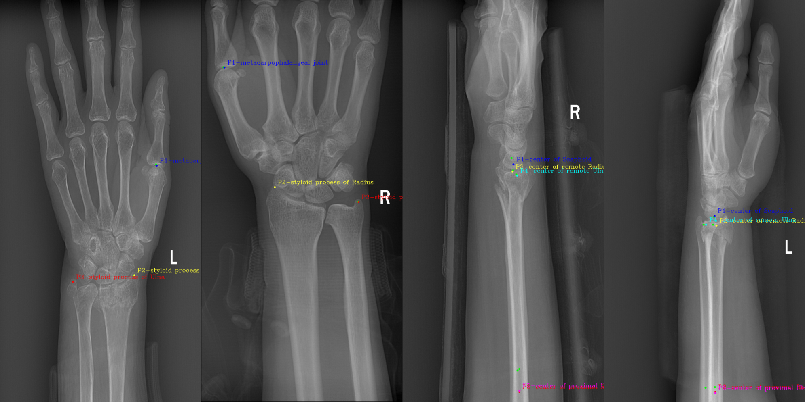

## A Quality Control Model for Wrist X-ray Images
### Visualization of model prediction results

### Visualization of model evaluation results

## Introduction
The project pipeline includes one classification model and two landmarks detection models.  At the same time, we checked the relevant information in the image file and left and right markers on images.   
classification referring to this paper: [MobileNetV2: Inverted Residuals and Linear Bottlenecks](https://arxiv.org/pdf/1801.04381.pdf)  
landmarks detection referring to this paper: [You Only Learn Once: Universal Anatomical Landmark Detection](https://arxiv.org/pdf/2103.04657.pdf)  

### Requirements:  
```angular2
python==3.9.12
albumentations==1.3.1
matplotlib==3.7.1
numpy==1.24.3
pydicom==2.4.0
PyYAML==6.0
PyYAML==6.0
scikit_learn==1.2.2
skimage==0.0
torch==2.0.1
torchsummary==1.5.1
torchvision==0.15.2
```
### Code Structure
```angular2
.
├── augmentation
│   ├── __init__.py
│   └── medical_augment.py
├── checkpoints
│   ├── model_best_wrist-classify-artifact.pth.tar
│   ├── model_best_wrist-classify-overlap.pth.tar
│   ├── model_best_wrist-classify-position.pth.tar
│   ├── model_best_wrist-landmarks-AP.pth.tar
│   └── model_best_wrist-landmarks-LAT.pth.tar
├── configs
│   ├── config_classify_artifact.yaml
│   ├── config_classify_overlap.yaml
│   ├── config_classify_position.yaml
│   ├── config_inference.yaml
│   ├── config_landmarks_AP.yaml
│   └── config_landmarks_LAT.yaml
├── data
│   ├── cp_mv.py
│   ├── gen_list_meta_position.py		# generate .txt about the name of files and label/coordinates
│   ├── gen_list_meta.py
│   ├── wrist		        # folder to save .png & .json
│   ├── wrist_AP		# folder to save .png & .json
│   └── wrist_LAT		# folder to save .png & .json
├── dataset
│   ├── __init__.py
│   ├── xray_classify_dataset.py
│   └── xray_landmark_dataset.py
├── depoly
│   ├── infer_with_tensorRT.py
│   ├── onnx_model_202307131414.onnx
│   ├── torch2onnx.py
│   └── trt_model.trt
├── eval		# Scoring by information in checking, mark of position and coordinates
│   ├── char_recognize.py
│   ├── chkmsg_judge.py
│   ├── __init__.py
│   └── point_judge.py
├── example_eval.png
├── example_infer.png
├── experiments
│   ├── wrist-classify-artifact
│   │   ├── indicators_of_valid.txt
│   │   └── log.txt
│   ├── wrist-classify-overlap
│   │   ├── indicators_of_valid.txt
│   │   └── log.txt
│   ├── wrist-classify-position
│   │   ├── indicators_of_valid.txt
│   │   └── log.txt
│   ├── wrist-landmarks-AP
│   │   ├── indicators_of_valid.txt
│   │   ├── log0808.txt
│   │   ├── pred_filenames.txt
│   │   └── pred_landmarks.txt
│   └── wrist-landmarks-LAT
│       ├── indicators_of_valid.txt
│       ├── pred_filenames.txt
│       └── pred_landmarks.txt
├── files_from_hos              	 	# folder to save .dcm
├── inference.py
├── inference_result
│   ├── DX145789.png
│   ├── DX148722.png
│   └── inference.json
├── inference_task              		# folder to save .dcm (files needed to be inferred)
│   ├── DX145789.dcm
│   └── DX148722.dcm
├── losses
│   ├── __init__.py
│   └── loss.py
├── models
│   ├── densenet.py
│   ├── GLNet.py
│   ├── globalNet.py
│   ├── __init__.py
│   ├── mobilenet.py
│   ├── resnet.py
│   └── unet_dw.py
├── README.md
├── read_result.py
├── requirements.txt
├── tools
│   ├── char-L0.png
│   ├── char-L1.png
│   ├── char-R0.png
│   ├── char-R1.png
│   ├── manual_evaluation_AP.xlsx
│   ├── classify_AP_LAT.py
│   ├── compare_manual_model_AP.py
│   ├── compare_manual_model_LAT.py
│   ├── dcm2png.py
│   ├── find_range.py
│   └── form_matched_image.py
├── train_classify.py
├── train_landmark.py
├── train.sh
├── utils
│   ├── heatmap.py
│   ├── __init__.py
│   ├── logger.py
│   ├── misc.py
│   └── progress_bar.py
└── wrist_data_dcm		# after executing 'classify_AP_LAT.py', dcm files will be moved here from 'files_from_hos'
    ├── wrist_AP
    └── wrist_LAT

```
## Quickly Start
1. Place DICOM files in directory `files_from_hos`
2. executing `classify_AP_LAT.py`, DICOM files will be moved to `wrist_data_dcm` (please modify the code as needed)
3. executing `tools/dcm2png.py`, then executing `data/gen_list_meta.py` after completing annotation (I used [labelme](https://github.com/wkentaro/labelme))   
4. modify the config file `experiments/config_xxx.yaml`
5. Training Model: `train_classify.py` `train_landmark.py`
6. Scoring in quality control:  `inference.py`

welcome to open an issue to communicate with me.  
